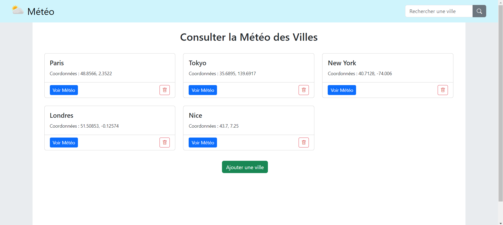
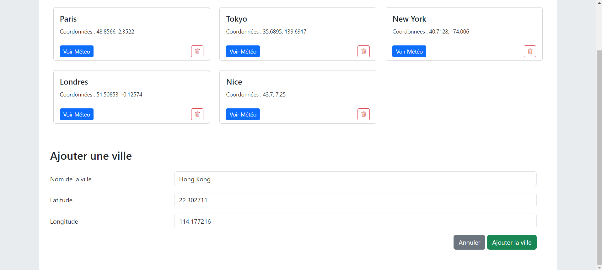
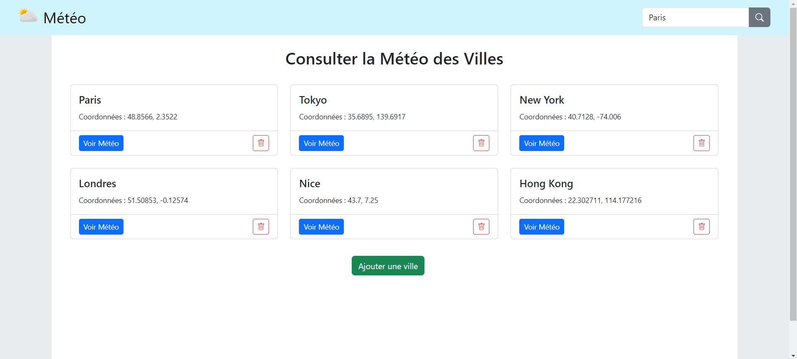
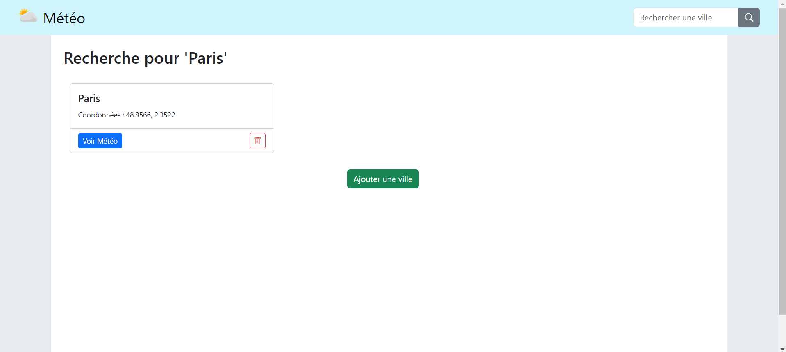
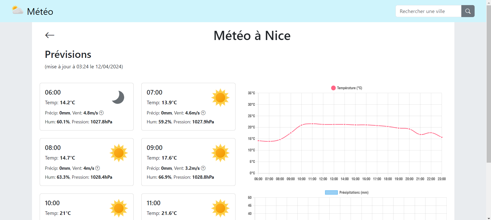
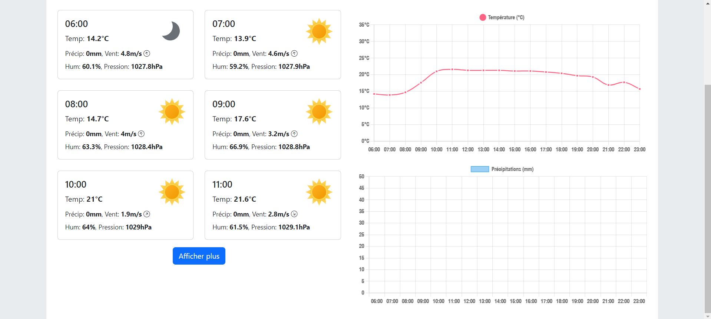

# WeatherApp

WeatherApp est une application web de consultation météorologique. Elle permet de consulter les prévisions de la journée. Elle a été développée à l'aide de ExpressJS (serveur), SQLite (bd) et Twig (templates).

## Commencer

Ces instructions vous permettront de mettre en place une copie du projet en exécution en local.

### Prérequis

Ce projet nécessite Node.js et npm pour s'exécuter localement. Assurez-vous de les avoir installés sur votre système.

### Installation

Suivez ces étapes pour configurer le projet localement :

1. Clonez ce dépôt sur votre machine locale :

```bash
# Commande pour cloner le dépôt
git clone https://exemple.com/weatherapp.git
cd weatherapp
```

2. Installez les dépendances :

```bash
# Commande pour installer les dépendances
npm install
```
   
3. Démarrez le serveur :

```bash
# Commande pour lancer l'application
npm start
```

L'application sera accessible sur le port 3000 ('http://localhost:3000')

## Usage

Utilisez l'application pour consulter les prévisions météorologiques de la journée par ville ajoutée en naviguant sur l'interface web.

1. Accéder à la page d'accueil (qui affiche la liste des villes ajoutées)
   


2. Ajouter une ville



3. Rechercher une ville





4. Consulter la météo d'une ville donnée





Plus de screenshoots disponibles dans le dossier `screens_ui` (responsive design).

## Documentation

La documentation du code est générée à l'aide de JSDoc. Vous pouvez la consulter en ouvrant le fichier `index.html` situé dans le dossier `docs`.

```bash
# Naviguez au dossier doc
cd doc

# Lancez le serveur HTTP
http-server
```

## Auteur

Beatriz Moura - Développement initial - BeaMoura0906
